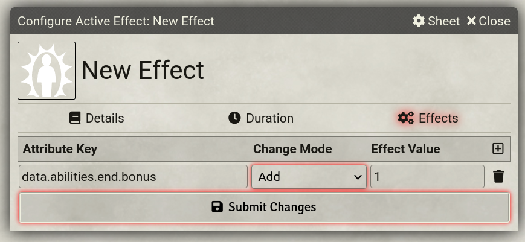

# FalloutEquestria System

This system is a foe system that you can use as a starting point for building your own custom systems. It's similar to Simple World-building, but has examples of creating attributes in code rather than dynamically through the UI.
## Blah blah blah
Anyway you can download it from here: 

`https://raw.githubusercontent.com/sapphie132/FalloutEquestriaVTT/master/system.json`
## Usage

### Effects
Effects are the primary way to increase your various stats.
Some stats, such as Skills and S.P.E.C.I.A.L stats can be edited directly,
however it is recommended to use effects for stat changes gained from perks,
as they allow to keep track of the effects individually.

The data keys for each character attribute are listed below.
#### S.P.E.C.I.A.L
For Strength, the primary attribute key is `str`, meaning that the data key is
`data.abilities.str.bonus`. The bonus gets added as a flat value on top of the
base score. There is no way to currently override your total score, but you can
override the raw value (the one visible and editable on your character sheet) by
using the data key `data.abilities.str.rawValue`. This is mostly useful if you want
to temporarily change your base score for that stat.

The primary attribute keys are
* Strength: `str`
* Perception: `per`
* Endurance: `end`
* Charisma: `cha`
* Intelligence: `int`
* Agitility: `agi`
* Luck: `luck`

#### Skills
Skills can also have their bonus edited. The key to do that is, for instance for
Unarmed, `data.skills.unarmed.bonus`. However, the formula to compute the base can
also be edited by overriding `data.skills.unarmed.customFormula`.

The keys for each skill can be found below.
* Unarmed: `unarmed`
* Throwing: `throwing`
* Melee: `melee`
* Firearms: `firearms`
* Magical Energy Weapons (M.E.W.): `mew`
* Explosives: `explosives`
* Battle Saddles: `bSaddles`
* Survival: `survival`
* Barter: `barter`
* Intimidation & Deception: `intimidation`
* Negotiation & Seduction: `persuasion`
* Sneak: `sneak`
* Lockpick: `lockpick`
* Sleight of Hoof: `sleightHoof`
* Hacking & Matrix Tech: `tech`
* Chemistry: `chem`
* Academic & Lore: `history`
* Repair: `repair`
* Gampling: `gambling`
* Athletics: `athletics`
* Profession: `profession`
* Shamanism: `shamanism`
* Arcane Magic: `magic`
* Flight Magic: `flight`

#### Resistances
For resistances, it is possible to override the formula. For instance,
`data.resistances.poison.formula` exposes the formula directly. However,
`data.resistances.poison.bonus` exposes a bonus.
The keys are:
* Fire: `fire`
* Cold: `cold`
* Lightning: `lightning`
* Poison: `poison`
Very straightforward.